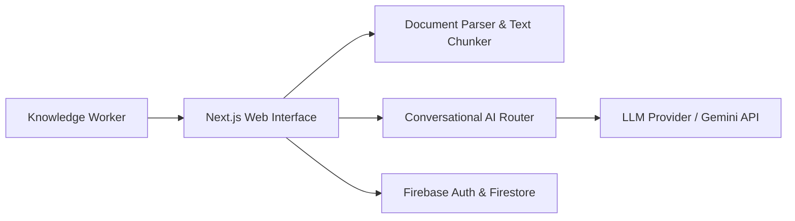
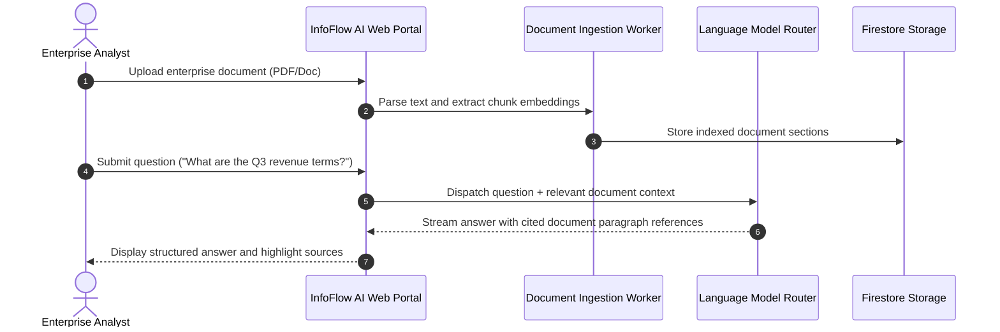

# InfoFlow AI — Document Intelligence & Conversational Workstream Portal
[]()
[]()
[]()
[]()

## Overview
InfoFlow AI is an enterprise document intelligence and generative AI workspace built on Next.js 15, Tailwind CSS, and Firebase. It enables teams to upload enterprise documents (PDFs, policy manuals, reports), extract structured semantic insights, and conduct conversational question-answering with citation grounding.

- **Problem Solved:** Information silos and manual document analysis across large corporate dossiers.
- **Target Users:** Enterprise analysts, research teams, legal paralegals, and knowledge workers.
- **Current Status:** Functional Web Portal.

## Features
- **Document Ingestion Hub:** Upload and manage multi-format corporate documentation.
- **Conversational AI Chat:** Ask natural language questions with contextual responses and source references.
- **Analytics & History:** Complete audit trail of user queries, response latencies, and interaction history.
- **Role-Based Workspaces:** Secured access controls powered by Firebase Authentication.

## Architecture


## User Flow


## Technology Stack
| Layer | Technology | Purpose |
|---|---|---|
| Framework | Next.js 15 (App Router) | Full-stack application architecture |
| Language | TypeScript | Type safety and domain contracts |
| UI & Styling | Tailwind CSS, Radix UI, Lucide | Clean corporate intelligence design |
| Auth & DB | Firebase Auth & Firestore | User identity and conversational storage |

## Infrastructure
- **Server Port:** 3000
- **Cloud Backend:** Firebase Platform

## Project Structure
```text
InfoFlowAi/
├── src/
│   ├── app/             # chat, dashboard, documents, history, login, signup
│   ├── components/      # ChatBubble, DocumentUploader, MetricsCard
│   ├── context/         # AuthContext
│   └── lib/             # Utility helpers
├── package.json         # Dependencies
├── .gitignore           # Git ignore definitions
└── README.md            # Technical documentation
```

## Prerequisites
- Node.js >= 18.x
- Firebase Project

## Environment Variables
Create `.env.local`:
```env
NEXT_PUBLIC_FIREBASE_API_KEY=your_firebase_api_key
NEXT_PUBLIC_FIREBASE_PROJECT_ID=your_firebase_project_id
NEXT_PUBLIC_FIREBASE_APP_ID=your_firebase_app_id
NEXT_PUBLIC_FIREBASE_AUTH_DOMAIN=your_project.firebaseapp.com
NEXT_PUBLIC_FIREBASE_MESSAGING_SENDER_ID=your_sender_id
```

## Local Development Setup
1. Clone the repository:
   ```bash
   git clone https://github.com/Bhanutejanallamothu/InfoFlowAi.git
   cd InfoFlowAi
   ```
2. Install dependencies:
   ```bash
   npm install
   ```
3. Run development server:
   ```bash
   npm run dev
   ```
4. Access platform at `http://localhost:3000`.

## Docker Setup
*Not detected in repository.*

## Database Setup
Firestore NoSQL database.

## API Documentation
- `POST /api/chat` - Submits contextual prompt and receives answers.
- `GET /api/documents` - Lists active uploaded workspace documents.

## Deployment
Deploy to Vercel or Firebase App Hosting:
```bash
npm run build
```

## Security
- Externalized environment secrets.
- Input validation to protect against prompt injection and cross-site scripting.

## Testing
```bash
npm run lint
```

## Troubleshooting
- Verify Firebase authorized domains in Firebase Console.

## Future Improvements
- Vector database integration (Pinecone / ChromaDB) for scalable semantic embedding search.

## License
No formal open-source license provided. All rights reserved by repository owner.
